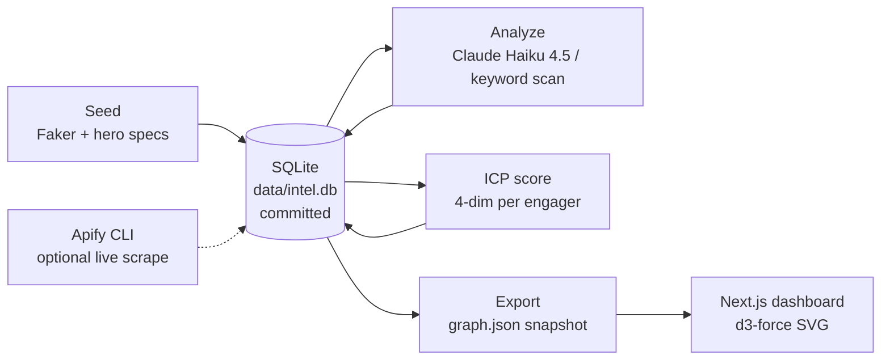

# Persona Graph

> Reps build mental models of their buyer persona from anecdote. "Our buyer is a VP of Sales at a Series B SaaS company, probably tired of Salesforce, follows a few people on LinkedIn." Cool. Now show me which LinkedIn posts they actually engage with, which tools they complain about by name, which subreddits they lurk in, and which other people you'd be selling to alongside them.
>
> Persona Graph scrapes LinkedIn KOLs, subreddits, and X handles for a target persona — the **GTM Engineer**, in v1 — and renders the data as a force-directed graph: sources in the perimeter, content in the middle, engagers around the content they engage with, colored by topic and sized by ICP fit.
>
> The point: stop guessing what the persona consumes. Look at it.

**Loom demo:** _coming once the build runs end-to-end — embed lands here_.

**Why the GTM Engineer persona?** Because if you're reading this README, you probably are one. You should see yourself on the graph.

---

## What it does

- **Scrapes 10 sources** for a target persona: 5 LinkedIn KOLs, 3 subreddits (r/sales, r/revops, r/SaaS), 5 X handles. (v1 uses a committed synthetic seed; live Apify scrape path documented in `docs/demo.md`.)
- **Tags every content item** with topics (8 thematic buckets) + signals (5 pain / 4 buying / 3 tool-mention) via **Claude Haiku 4.5** in live mode or regex-keyword scan in dry-run.
- **Scores every engager** on 4 ICP dimensions (b2b + seniority + company-size + GTM-relevance), tier-classifies them tier_1 → not_icp. Pattern borrowed from gooseworks-ai/goose-skills `icp-persona-builder` + `champion-tracker`.
- **Stores everything in SQLite-in-git** (`data/intel.db` committed to the repo). Diffable data layer. `git log data/intel.db` is the audit trail. Pattern verbatim from Shawn Logan's Nexus Intel.
- **Renders a Next.js dashboard** with a d3-force graph: 3 node types (sources / content / engagers), colored by topic + tier, sized by engagement + ICP score. Hover for details. Click a topic to filter the graph in place.

## What this is not

- **Not a customer-facing app.** Internal dashboard. No auth, no API, no DB writes from the browser. Read-only over a JSON snapshot.
- **Not a real scrape in v1.** The synthetic seed is committed for reproducibility + zero-cost-to-clone. Live Apify path documented separately.
- **Not multi-tenant.** One persona (GTM Engineer) in v1. Schema supports more; adding them is a config change.
- **Not real-time.** Scrapes are batch (weekly cron in production). The graph is a snapshot from the last export.
- **Not a customer-acquisition tool.** It's pre-pipeline intel — the input to outreach, not the outreach itself.

---

## Quickstart

```bash
git clone https://github.com/ryanmichaels-jpg/persona-graph
cd persona-graph
./scripts/setup.sh                           # Python venv + npm install + chflags + init DB
source .venv/bin/activate
python scripts/generate_seed.py              # populate data/intel.db (synthetic GTM-Engineer corpus)
python scripts/analyze_content.py            # keyword-tag topics + signals (no LLM in dry-run)
python scripts/score_engagers.py             # 4-dim ICP score per engager
python scripts/export_graph_data.py          # SQLite → data/graph.json
npm run dev                                  # http://localhost:3000
```

The Python pipeline finishes in < 5 seconds. Next.js boots in ~3.

**Live mode** (real Claude tagging):
```bash
python scripts/analyze_content.py --live     # Claude Haiku 4.5, ~$0.005/item
python scripts/export_graph_data.py
```

**Slash command** (inside Claude Code):
```
/persona-graph                               # rebuild + open dashboard
/persona-graph --live                        # rebuild with live Claude tagging
```

---

## Architecture



Full module-by-module breakdown + tradeoffs in [`docs/architecture.md`](docs/architecture.md). 2-min Loom storyline + Apify + Railway setup in [`docs/demo.md`](docs/demo.md).

---

## Numbers from the committed seed

| stage                       | runtime | output                                                |
|-----------------------------|---------|-------------------------------------------------------|
| seed                        | ~0.3s   | 10 sources · 80 content items · 40 engagers           |
| analyze (keyword)           | ~0.1s   | 32 new topic tags + 62 new signal tags (on top of seed) |
| icp score                   | ~0.05s  | 32 tier_1 · 7 tier_2 · 1 tier_3                       |
| export → graph.json         | ~0.1s   | 108 KB · 130 nodes · 237 edges                        |
| `next build`                | ~10s    | 4 static pages · 6.86 KB page + 109 KB first-load JS  |

Hero posts (visible in the graph as white-ringed nodes):
- "Just shipped a stale-deal scanner..." (LinkedIn, 412 reactions)
- "Anyone else feeling like RevOps in 2026 is just LLM glue code?" (Reddit, 184 comments)
- "Hiring our first GTM Engineer at Stripe..." (X, 1242 reactions — hot lead)
- "Hot take: Clay is great, but 80% of the table operations..." (LinkedIn)
- "Salesforce is unusable in 2026..." (Reddit, 297 comments)

---

## The 4-dim ICP score (per engager)

Borrowed from gooseworks-ai/goose-skills `icp-persona-builder` + `champion-tracker`.

| dimension          | what it measures                                                            |
|--------------------|-----------------------------------------------------------------------------|
| `b2b_score`        | Is this title B2B-relevant?                                                 |
| `seniority_score`  | VP/Founder/C-level (1.0) → IC (0.25)                                        |
| `company_size_score` | Sweet spot 100–2,500 employees (Series A–D, first-GTM-Engineer-hire window) |
| `gtm_relevance_score` | GTM Engineer (1.0) → RevOps (0.9) → Sales/Marketing (0.4) → Eng (0.1)    |

Sum to total in [0, 4]. Tier mapping: `>=3.0 tier_1`, `>=2.0 tier_2`, `>=1.0 tier_3`, `<1.0 not_icp`.

---

## Repo layout

```
persona-graph/
├── README.md / CLAUDE.md                    # this file + Claude Code context
├── .claude/commands/persona-graph.md         # /persona-graph slash command
├── pyproject.toml                            # Python (seed + analyze + score + export)
├── package.json                              # Next.js + d3-force + types
├── tsconfig.json + next.config.js
├── docs/
│   ├── architecture.md                       # mermaid + module breakdown + tradeoffs
│   └── demo.md                               # 2-min Loom flow + Apify + Railway setup
├── src/persona_graph/                        # Python package
│   ├── db.py                                 # thin SQLite wrapper
│   ├── seed/                                 # Faker + 5 hero posts + 10 sources
│   ├── analyze/                              # Claude Haiku tagger / keyword fallback
│   ├── icp/                                  # 4-dim scoring rules
│   └── export.py                             # SQLite → data/graph.json
├── scripts/
│   ├── setup.sh                              # venv + npm + chflags + init DB
│   ├── init_db.sql                           # 10-table schema
│   ├── generate_seed.py                      # standalone seed regen
│   ├── analyze_content.py                    # standalone analyze
│   ├── score_engagers.py                     # standalone scoring
│   └── export_graph_data.py                  # standalone export
├── app/                                      # Next.js App Router
│   ├── layout.tsx
│   ├── page.tsx                              # server component reading data/graph.json
│   └── globals.css                           # dark theme matching sibling reports
├── components/
│   └── PersonaGraph.tsx                      # client d3-force SVG
├── lib/
│   └── data.ts                               # TS types mirroring export.py
├── data/
│   ├── intel.db                              # SQLite seed — committed
│   └── graph.json                            # JSON snapshot — committed
└── tests/                                    # 29 Python tests across 4 modules
```

---

## Credits

- **SQLite-in-git data layer + diffable-DB philosophy** lifted from [Shawn Logan's `gtm-coding-agent`](https://github.com/shawnla90/gtm-coding-agent), Nexus Intel chapter. The DB itself is committed, `git log data/intel.db` is the audit trail.
- **Apify CLI scraper pattern** (`apify call <actor-id> --input <json>`) and specific actors (`harvestapi`, `apidojo/tweet-scraper`, `trudax/reddit-scraper-lite`) — same source.
- **4-dimension ICP scoring** from [gooseworks-ai/goose-skills](https://github.com/gooseworks-ai/goose-skills) → `icp-persona-builder` + `champion-tracker`.
- **Pain-language signal taxonomy** from gooseworks-ai/goose-skills → `pain-language-engagers`.
- **Bounded Claude agent shape** (one structured-output call, no tool loop) vendored from [reply-guy](https://github.com/ryanmichaels-jpg/reply-guy).
- **Dark-theme dashboard design system** vendored from [cleanroom](https://github.com/ryanmichaels-jpg/cleanroom) + [pipeline-resurrection](https://github.com/ryanmichaels-jpg/pipeline-resurrection) report templates.
- **Sibling-repo conventions** (macOS chflags, `DRY_RUN=1` default, slash-command-first, synthetic-seed pattern) from all four prior projects in this portfolio.
