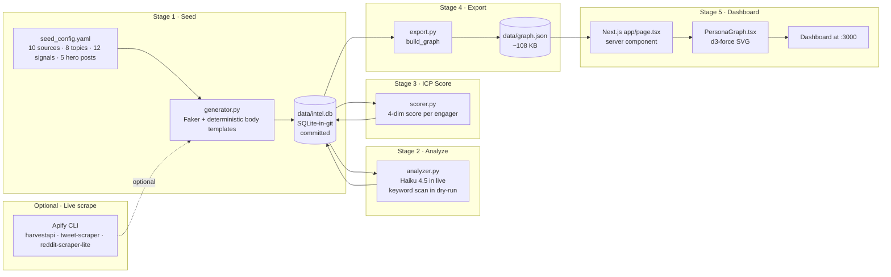

# Persona Graph — Architecture

## Data flow

## Module breakdown

| Module                                  | Purpose                                                                  |
|-----------------------------------------|--------------------------------------------------------------------------|
| `seed.generator`                        | Faker-based 80-item content factory. Hero posts first, random fill rest. |
| `seed.seed_config.yaml`                 | All distributions + hero specs + topic/signal taxonomy in one place.    |
| `analyze.analyzer`                      | Claude Haiku 4.5 in `--live`; deterministic regex tagger in dry-run.    |
| `icp.scorer`                            | 4-dim ICP score (b2b + seniority + size + gtm_relevance). Tier mapping. |
| `export.build_graph` / `export_graph_json` | SQLite → graph.json snapshot with 3 node types + 2 edge types.       |
| `app/page.tsx`                          | Server component reading data/graph.json from disk.                     |
| `components/PersonaGraph.tsx`           | Client component: d3-force simulation, SVG render, hover + topic filter. |
| `lib/data.ts`                           | TS types mirroring src/persona_graph/export.py exactly.                 |

## Why these choices

- **SQLite-in-git, not a hosted DB.** Per Shawn Logan's Nexus Intel: `data/intel.db` is one file, committed to the repo. `git log data/intel.db` is the audit trail. `git checkout <sha> -- data/intel.db` time-travels the dataset. For a < 500 MB intel layer, this beats any hosted DB on cost + reproducibility.
- **JSON snapshot for the dashboard, not live SQLite queries.** Shawn's Nexus Intel reads SQLite directly from Next.js via `better-sqlite3`. We instead export to `data/graph.json` because `better-sqlite3` is a native module that requires `node-gyp` to compile — and that compile reliably breaks on modern Node + macOS without sudo cleanup. The JSON snapshot pattern keeps the dashboard pure-JS at the cost of losing live-write reflection (the dashboard requires a re-export to see new data).
- **Synthetic seed for the demo path.** Live Apify scraping costs ~$3/run + 10 minutes wait + needs an Apify account. The committed `data/intel.db` lets a recruiter clone and `npm run dev` and see the graph immediately. Live scrape path is documented in `docs/demo.md` for the polish use case.
- **One bounded Claude call per content item, not a tool loop.** Same pattern vendored from reply-guy. At < 100-item scale, batched single-shot beats a multi-turn tool loop on cost + simplicity.
- **d3-force in SVG, not Canvas or WebGL.** 130 nodes + 237 edges renders at 60fps in SVG. WebGL would be overkill. Canvas would lose React state binding.

## Tradeoffs the docs admit to

- **One persona in v1, schema supports many.** Adding a second persona means adding rows to `personas`, new `content_sources` rows, a new ICP scoring config, and a persona-picker in the dashboard. Out of scope for this build.
- **No live Apify scraping in v1.** The committed synthetic seed is the data layer. Live scrape would be a separate `scripts/run_apify_scrape.py` (not built; documented).
- **Dashboard is read-only.** No auth, no API, no DB writes from the browser. Intentional: this is an internal dashboard, not a customer app.
- **Topic/signal taxonomy is hand-curated.** A `taxonomy_extractor.py` that has Claude propose new topics + signals from the corpus is the obvious v2 step but not built.
- **Engager ICP scoring uses title strings, not Apollo person-match.** Real-world deployment would enrich each engager via Apollo `/v1/people/match` before scoring. v1 just uses the synthetic title field.
- **No Railway deploy in v1.** Local + screenshot for the Loom is the demo path. Railway deploy notes are in `docs/demo.md` as the polish step.

## The 4-dimension ICP score

Borrowed shape: gooseworks-ai/goose-skills `icp-persona-builder` + `champion-tracker`. Each dimension is 0–1, summed for total in [0, 4].

| dimension          | what it measures                                                  |
|--------------------|-------------------------------------------------------------------|
| `b2b_score`        | Is this title B2B-relevant? Engineering/design = lower. Sales/Marketing/Ops = 1.0. |
| `seniority_score`  | VP/Founder/C-level = 1.0; Director/Head = 0.75; Manager/Lead = 0.5; IC = 0.25. |
| `company_size_score` | Sweet spot 100–2500 employees (Series A–D, when first GTM Engineer hires). |
| `gtm_relevance_score` | Title's distance from the GTM Engineer persona. GTM Engineer = 1.0, RevOps = 0.9, Sales = 0.4, Eng = 0.1. |

Tiers: `>=3.0 tier_1`, `>=2.0 tier_2`, `>=1.0 tier_3`, `<1.0 not_icp`.
